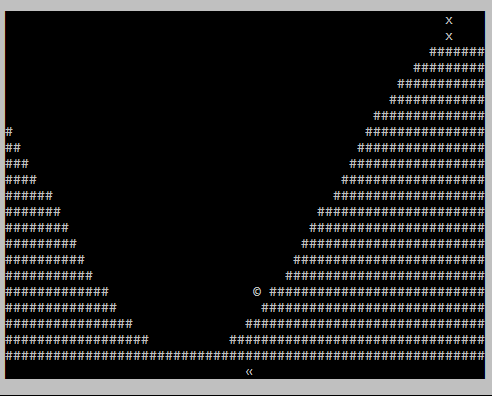

# torchRL

torchRL is a C++ reinforcement learning library using PyTorch C++ backend LibTorch.

Don't expect it to grow with thousands of algorithms and envs. This is just a toy project I did on the side to learn a bit more about RL impementations (and also as an excuse to discover ImPlot). I might add some stuff in the future, but this is clearly not a project I'll work a lot on. I just share the code in case some people are interested.

## Content
- [Features](#features)
- [Building](#building)
- [Comparison with stable-baselines3](#comparison-with-stable-baselines3)
  * [Training on Pendulum](#training-on-pendulum)
  * [Playing with trained agents](#playing-with-trained-agents)

# Features

Only PPO for continuous action environment is coded, but with most of the implementation tricks detailed in the awesome [PPO implementation blog](https://iclr-blog-track.github.io/2022/03/25/ppo-implementation-details/). Two C++ reimplementation of gym environments are available: Pendulum and MountainCarContinuous. Their behaviour should be identical to gym ones. Here are some examples of a PPO agent trained with torchRL on both environments:

| Pendulum | MountainCar |
|--------------|--------------|
|  |  |


Training logs are saved in a csv file, and can also be printed in the console. If `TORCHRL_IMPLOT_LOGGER` is set in cmake, real-time plotting can also be enabled to display a nice [ImPlot](https://github.com/epezent/implot) interface.


# Building

All the dependencies are managed by cmake except libtorch that you need to manually download from [Pytorch website](https://pytorch.org/get-started/locally/). torchRL does not use CUDA so you can install the CPU only version. Be careful if you're on Windows, as a Debug LibTorch is not compatible at runtime with a Release build of torchRL.

I only tested the compilation on Windows, so if you're on Linux you might encounter some missing headers or stuff like that. Feel free to open an issue with all the errors and I should be able to fix them quickly (you can also open an issue if everything works so I can remove this line).

```bash
git clone https://github.com/adepierre/torchRL
cd torchRL
mkdir build
cd build
cmake -DTORCHRL_IMPLOT_LOGGER=ON -DTORCH_LIBRARY=/my/path/to/libtorch/cmake/share/folder ..
make all
```

# Comparison with stable-baselines3

To test torchRL performances, I compared it to [stable-baselines3](https://github.com/DLR-RM/stable-baselines3). Obviously, this is not a real fair comparison as the code of the environments and the random generators are different even with the same seeds. I tried to use the same hyperparameters on both code to be as close as possible. In each case, I launched the training on 10 different seeds, and tested each trained agent on 100 episodes. All tests were made on the same hardware, with default pytorch configurations (libtorch and pip install). The code to generate the data for stable-baselines3 (resp. torchRL) is available in [stable-baselines3.py](https://github.com/adepierre/torchRL/blob/master/stable-baselines3.py) (resp. examples/EnvName/src/main.cpp) for reproducibility.

## Training on Pendulum

The following curves show the episode reward gathered during training. As can be seen, torchRL PPO is learning "faster", reaching the plateau around 15000 playing steps before the other one. However it's way less stable once the plateau is reached. I guess this is due to a difference of implementation, but I haven't found where. Don't hesitate to open an issue if you have an idea. When plotting the episode reward against the real time clock, we can see the benefit from using C++ over python, as torchRL training is done in only 50 seconds against 135 for stable-baselines3. Part of this gap might also be explained by other stable-baselines features that torchRL is lacking (more logging, callbacks system...).


## Playing with trained agents

The following plots show the reward gathered by the trained agents on 100 episodes for each implementation on both envs. Results are very similar. The main difference being for the mountain car environment, for which stable-baselines3 PPO didn't find a solution for 4 seeds, versus only 1 for torchRL. But as random engines are not the same for both implementations, I don't think this is really significant on 10 seeds.


